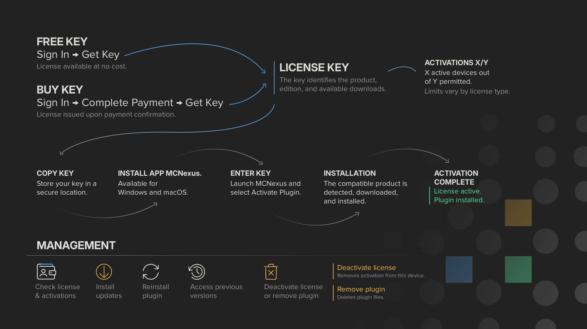
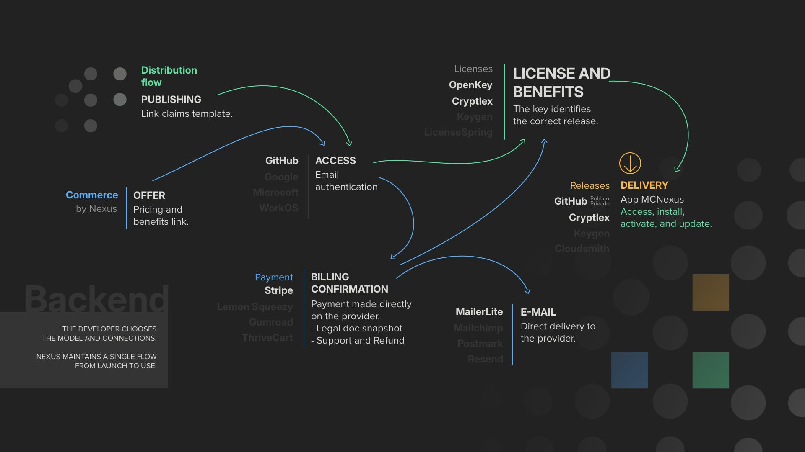

---

[English](README.md) · [Português](pt-BR/README.md)

**Licensing, distribution, and updates for native software that runs offline.**

Nexus is infrastructure for licensing, distributing, and updating native
desktop software: activation certificates signed per tenant and bound to a
machine, an offline validity window that survives days without a network,
protected release delivery, and rollback to a previous version. MCNexus is the
macOS and Windows application that performs activation, installation, updates,
and rollback on the workstation.

The licensing core is not specific to OFX: an activation certificate is scoped
to a tenant and a machine, not to a product or a plugin format. OFX plugins for
post-production hosts are where it runs in production today, and every
integration operating now is an OFX project.

Developer integrations are configured per project. Sales run through the
developer's own Stripe account: a purchase records the order, issues the license,
delivers the key by one-time reveal, sends the transactional email, and stores
which terms the customer accepted. The same backend issues the license
whether the product is free or paid, so starting to charge does not mean
changing licensing provider, and a developer already using another licensing
platform can keep it.
Additional providers, other kinds of software, and public self-service
onboarding are on the [roadmap](docs/ROADMAP.md).

<table>
  <tr>
    <td width="65%">
      
    </td>
    <td>
      
       
      <small>Recommended for Windows</small>
        
      
       
      
    </td>
  </tr>
</table>

The **Microsoft Store is the official and recommended installation channel for Windows**, providing code integrity and automatic background updates. The `.exe` installer remains available through GitHub as an alternative for manual installation.

> **Installation notice:** the direct Windows installer distributed through GitHub is not currently code-signed and may display a Microsoft Defender SmartScreen warning. The macOS build is not currently signed with an Apple Developer ID certificate or notarized by Apple, so Gatekeeper may also display a warning. Official downloads are available through the Microsoft Store and this repository.

## Discover Plugins

Explore the OFX plugins already integrated with Nexus.

[View integrated plugins](docs/DISCOVERY.md) · [Suggest a plugin](https://github.com/ciqueira/MCNexus/issues/new?template=plugin_suggestion.yml)

## For Users

MCNexus manages the lifecycle of plugins installed on a workstation, from initial activation to installing a previous version.

- **Automatic installation:** downloads and installs OFX files in the native directory defined by the operating system.
- **Updates and rollback:** identifies published versions and allows an available update or previous version to be installed.
- **Independent actions:** activating a license, deactivating it, removing the local key, and removing plugin files are separate operations.
- **Moving between computers:** when the previous computer is accessible, deactivate the license there before activating it on another machine. Remote releases and activation-limit adjustments still require support.

[Start with the User Guide](docs/USER_GUIDE.md)

## For Developers

Backend, native SDK and client app, for native software that runs offline,
commercial or open source. Integrations are reviewed and configured per
project; public self-service onboarding is on the [roadmap](docs/ROADMAP.md).
Every integration in production today is an OFX plugin.

- **Node-locked activation.** Each activation is an Ed25519 certificate, signed
  by a key scoped to a single tenant and bound to the machine fingerprint, with
  a seat limit per license and self-service deactivation — the user releases the
  seat, without going through support. Two backends issue that license:
  **OpenKey**, native to Nexus, and **Cryptlex**, for developers already using
  it as their platform. Both are node-locked; what differs is who owns the
  platform, not the mechanism.
  → [Distribution models](docs/DEVELOPERS.md#2-distribution-models)

- **Offline and air-gap.** A licensed product does not ask a server for
  permission to run: the SDK verifies the certificate against a public keyring
  compiled into the binary, on the machine, with no network. The certificate
  carries two independent deadlines — `syncAfter`, when the background thread
  starts *trying* to renew (default 24 h), and `offlineValidUntil`, the hard
  limit the SDK itself enforces (default 30 days, configurable per license up to
  365). The issuer enforces a lock across the two: the offline window always
  covers at least two full renewal attempts, so a failed sync is never what
  denies a license. A machine with no network at all activates and deactivates
  through exported files, over the same path.
  → [Why an interruption is not a denial](docs/CONTINUITY.md#1-why-an-interruption-is-not-a-denial)
  · [Offline activation in the SDK](https://github.com/ciqueira/NexKeyRuntime/blob/main/docs/OFFLINE.md)

- **NexKeyRuntime, the native SDK.** C/C++14 with a stable C ABI, for macOS
  universal (arm64 and x86_64) and Windows x64. On the render thread the license
  decision is a single atomic read: no lock, no allocation, no syscall, no
  network, no file I/O and no JSON parsing. Two integration profiles: under
  **Profile A** MCNexus activates the license and the product verifies it
  locally; under **Profile B** the product activates, synchronizes and
  deactivates on its own, with no client app in the loop. The repository
  publishes the full contract under Apache-2.0 — the C header, the JSON Schemas,
  integration documentation and examples; compiled binaries ship as releases with
  checksums, and access to them is arranged with each developer under the binary
  license. The API is at `0.x`; result codes are append-only by policy and are
  never reused or renumbered.
  → [NexKeyRuntime](https://github.com/ciqueira/NexKeyRuntime)
  · [Integration](https://github.com/ciqueira/NexKeyRuntime/blob/main/docs/INTEGRATION.md)
  · [ABI policy](https://github.com/ciqueira/NexKeyRuntime/blob/main/docs/ABI_POLICY.md)
  · [JSON Schemas](https://github.com/ciqueira/NexKeyRuntime/tree/main/schemas)
  · [Client SDK](docs/DEVELOPERS.md#7-client-sdk-nexkeyruntime)

- **MCNexus client.** For OFX plugins, the macOS and Windows app activates the
  license and performs installation, updates and rollback on the workstation — a
  Profile A product does not have to write, sign or distribute a client of its
  own. Activating, deactivating, removing the local key and removing the plugin
  files are independent operations.
  → [User Guide](docs/USER_GUIDE.md)

- **Key ownership and continuity.** What the SDK trusts is the product's
  keyring, not the server: whoever holds the private half of a key in that
  keyring can issue certificates that already-installed copies accept, with no
  Nexus infrastructure involved. The keyring holds up to four keys, and a retired
  key stays in it and merely stops signing — which is why rotation does not
  invalidate what is already installed. The recovery key is generated by the
  developer: only the public half is uploaded, an upload containing the private
  half is **refused**, and it signs nothing in normal operation.
  → [If the operator is no longer available](docs/CONTINUITY.md#3-if-the-operator-is-no-longer-available)

- **Distribution and rollback.** Releases come from the source configured for
  the project and are served through a download proxy with a short-lived signed
  token — the app never receives the real release URL. Platform-specific
  packages, version discovery, and reinstalling a previously published version
  when a release breaks a project. Cryptographic integrity verification of
  packages is on the [roadmap](docs/ROADMAP.md).
  → [Security and distribution](docs/DEVELOPERS.md#6-security-and-distribution)

- **Editions and entitlements.** Beta, Demo, Trial and Full, the same four in a
  free or paid project — Trial is time-limited, Demo is not. When a product ships
  in several variants within the same release, per-asset entitlements define what
  each license unlocks, and the activation scope is unique per tenant,
  fingerprint and entitlement: the same machine cannot occupy two seats for the
  same right. For Cryptlex products, editions and activation limits come from the
  developer's own account.
  → [Channels and editions](docs/DEVELOPERS.md#4-channels-and-editions)

- **Commerce and fulfillment.** Sales run through the developer's own Stripe
  account. Configured once, an offer catalog ties price, product, payment account
  and the terms, privacy and refund URLs shown at checkout. On each sale Nexus
  records the order, the payment event and which version of the terms the
  customer accepted, creates or updates the license, and delivers the key by
  one-time reveal with a transactional email. Fulfillment attempts are recorded
  per order, so a retried payment event does not issue a second license. Cryptlex
  products have the license issued through the developer's own channel; issuing
  it through Nexus Commerce is on the [roadmap](docs/ROADMAP.md).
  → [Current Nexus Commerce flow](docs/DEVELOPERS.md#5-current-nexus-commerce-flow)
  · [Integrated providers](docs/DEVELOPERS.md#8-integrated-providers)

- **In-product notices.** Severities `critical`, `recommended` and `info`, with
  localized content and targeting by host, plugin version range, platform and
  architecture. The user dismisses or postpones a notice, and the product sets
  its own check policy and how many notices it shows at once. The content is
  text: HTML, arbitrary Markdown and script were left out by scope decision. It
  arrives over the same channel as updates.
  → [Updates and notices in the SDK](https://github.com/ciqueira/NexKeyRuntime/blob/main/docs/UPDATES_AND_NOTICES.md)

[Understand developer integration](docs/DEVELOPERS.md)

## Application Compatibility

- **macOS:** macOS 15 or later, including Apple Silicon and supported Intel Macs.
- **Windows:** Windows 10/11 x64, with Windows 11 ARM support through x64 emulation.
- **Linux:** under consideration when compatible plugins and user demand
  justify the additional platform lifecycle.

## Project

Nexus combines software engineering with practical experience in audiovisual
post-production. Developed independently by
[Magno Ciqueira](https://www.linkedin.com/in/ciqueira/)
([Instagram](https://www.instagram.com/magnociqueira/)), the project aims to
reduce technical friction and provide distribution infrastructure for
commercial and open-source tools.

## Documentation

- [Discovery](docs/DISCOVERY.md)
- [User Guide](docs/USER_GUIDE.md)
- [Developer Documentation](docs/DEVELOPERS.md)
- [Frequently Asked Questions](docs/FAQ.md)
- [Roadmap](docs/ROADMAP.md)
- [Continuity and Recovery](docs/CONTINUITY.md)
- [License](LICENSE.md)
- [Source Notice](NOTICE.md)
- [Trademark Notice](TRADEMARKS.md)
- [Security Policy](SECURITY.md)
- [Terms of Use](TERMS.md)
- [Privacy Policy](PRIVACY.md)
- [Tenant Legal Documentation Guide](docs/TENANT_LEGAL_GUIDE.md)

## Source Availability

This repository is public for transparency and review. It is source-available, not open source software. Redistribution, unofficial builds, derivative products, and use of MCNexus branding require prior written permission. See [LICENSE.md](LICENSE.md), [NOTICE.md](NOTICE.md), and [TRADEMARKS.md](TRADEMARKS.md).

## Support

Use the [GitHub support forms](https://github.com/ciqueira/MCNexus/issues/new/choose) for technical problems, activation questions, bug reports, and suggestions. Include the operating-system version, MCNexus version, affected plugin, and available diagnostics.

GitHub Issues are public and indexed by search engines. Do not publish a complete license key or personal data. Privacy requests must be sent to [hello@mcnexus.app](mailto:hello@mcnexus.app).
