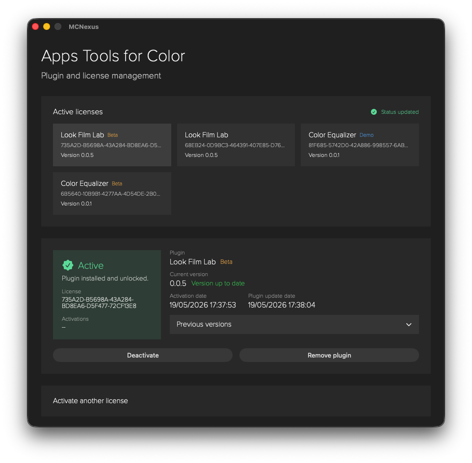
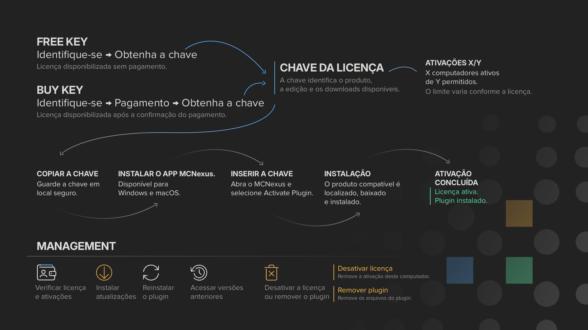
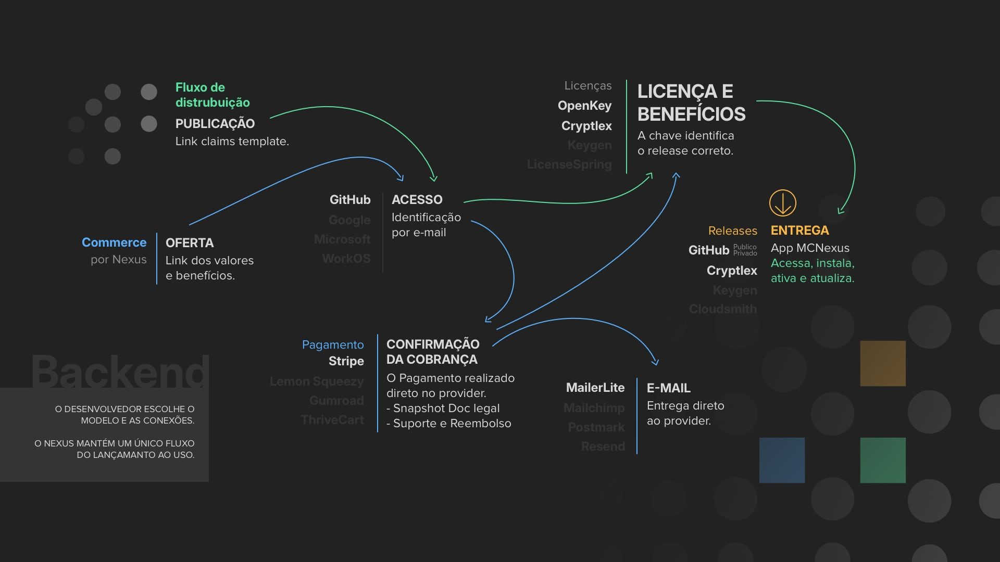

---

[English](../README.md) · [Português](README.md)

**Licenciamento, distribuição e atualização de software nativo que roda offline.**

O Nexus é infraestrutura para licenciar, distribuir e atualizar software nativo
de desktop: certificados de ativação assinados por tenant e vinculados a uma
máquina, uma janela de validade offline que sobrevive a dias sem rede, entrega
protegida de releases e rollback para uma versão anterior. O MCNexus é o
aplicativo para macOS e Windows que executa ativação, instalação, atualizações
e rollback na estação de trabalho.

Plugins OFX para hosts de pós-produção são o primeiro tipo de software em
produção, e toda integração em operação hoje é um projeto OFX. O núcleo de
licenciamento em si não é específico de OFX: um certificado de ativação tem
escopo de tenant e máquina, não de produto ou formato de plugin.

As integrações para desenvolvedores são configuradas por projeto. Atualmente,
a plataforma oferece OpenKey e Cryptlex para licenciamento, releases hospedados
no GitHub ou no Cryptlex conforme a integração e um fluxo Commerce controlado
com GitHub, Stripe, OpenKey e MailerLite. Outros providers, tipos de software
além de OFX e o onboarding público self-service permanecem no
[roadmap](docs/ROADMAP.md).

<table>
  <tr>
    <td width="65%">
      
    </td>
    <td>
      
       
      <small>Opção recomendada para Windows</small>
        
      
       
      
    </td>
  </tr>
</table>

A **Microsoft Store é o canal oficial e recomendado para instalação no Windows**, garantindo integridade de código e atualizações automáticas em segundo plano. O instalador `.exe` continua disponível no GitHub como alternativa para instalação manual.

> **Observação sobre a instalação:** o instalador direto para Windows distribuído pelo GitHub ainda não possui assinatura de código e pode exibir um alerta do Microsoft Defender SmartScreen. A versão para macOS ainda não possui assinatura com certificado Apple Developer ID nem notarização pela Apple, portanto o Gatekeeper também pode exibir um alerta. Os downloads oficiais estão disponíveis na Microsoft Store e neste repositório.

## Plugins Integrados

Lista de plugins OFX integrados ao Nexus.

[Ver plugins integrados](docs/DISCOVERY.md) · [Indicar um plugin](https://github.com/ciqueira/MCNexus/issues/new?template=plugin_suggestion.yml)

## Operação em Ilhas de Pós-Produção

O MCNexus cuida do ciclo de vida dos plugins instalados na estação de trabalho, da primeira ativação à instalação de uma versão anterior.

- **Instalação automática:** baixa e instala os arquivos OFX no diretório nativo definido pelo sistema operacional.
- **Atualização e rollback:** identifica versões publicadas e permite instalar uma atualização ou retornar a uma versão anterior disponível.
- **Ações independentes:** ativar uma licença, desativá-la, remover a chave local e remover os arquivos do plugin são operações diferentes.
- **Transferência entre computadores:** quando o computador anterior está acessível, a licença pode ser desativada nele antes da ativação em outra máquina. Liberações remotas e ajustes de ativações continuam sendo tratados pelo suporte.

[Começar pelo Guia de Operação](docs/USER_GUIDE.md)

## Para Desenvolvedores

O Nexus oferece fluxos de distribuição para projetos comerciais e open
source. As integrações são revisadas e configuradas por projeto, e toda
integração em produção hoje é um plugin OFX; não existe um processo público de
onboarding self-service.

- **Backends de licenciamento:** o OpenKey é o License Provider nativo do Nexus,
  enquanto o Cryptlex oferece licenciamento comercial vinculado ao hardware. O
  MCNexus valida os dois tipos de licença.
- **Composição Commerce atual:** o GitHub fornece identidade verificada, o
  Stripe confirma o pagamento, o OpenKey executa o fulfillment da licença e o
  MailerLite entrega mensagens operacionais. O fulfillment Commerce completo
  pelo Cryptlex e providers adicionais de pagamento e e-mail permanecem no
  roadmap.
- **Canais comerciais externos:** produtos licenciados ou vendidos por um
  serviço externo configurado podem utilizar o mesmo fluxo de ativação,
  release, download protegido, instalação, atualização e rollback.
- **SDK de cliente:** o [NexKeyRuntime](https://github.com/ciqueira/NexKeyRuntime)
  é a SDK pública em C/C++14 para descoberta de atualizações, avisos de produto
  e verificação offline de certificados de ativação. Seu contrato é Apache-2.0;
  a licença dos binários compilados ainda é rascunho, então o uso por terceiros
  não está liberado.
- **Gerenciamento de releases:** projetos OpenKey podem usar GitHub Releases e
  produtos configurados com Cryptlex podem usar os releases hospedados pelo
  provider. Ambos utilizam no MCNexus pacotes por plataforma, downloads
  protegidos, descoberta de versões, atualização e rollback.
[Entender a integração para desenvolvedores](docs/DEVELOPERS.md)

## Compatibilidade do Aplicativo

- **macOS:** macOS 15 ou posterior, incluindo Apple Silicon e Macs Intel compatíveis.
- **Windows:** Windows 10/11 x64, com suporte ao Windows 11 ARM por emulação x64.
- **Linux:** em consideração quando os plugins compatíveis e a demanda dos
  usuários justificarem o ciclo adicional de plataforma.

## Projeto

O Nexus combina engenharia de software com experiência prática em pós-produção
audiovisual. Desenvolvido de forma independente por
[Magno Ciqueira](https://www.linkedin.com/in/ciqueira/)
([Instagram](https://www.instagram.com/magnociqueira/)), o projeto tem como
objetivo reduzir fricções técnicas e oferecer infraestrutura de distribuição
para ferramentas comerciais e de código aberto.

## Documentação

- [Discovery](docs/DISCOVERY.md)
- [Guia de Operação](docs/USER_GUIDE.md)
- [Documentação para Desenvolvedores](docs/DEVELOPERS.md)
- [Perguntas Frequentes](docs/FAQ.md)
- [Roadmap](docs/ROADMAP.md)
- [Continuidade e Recuperação](docs/CONTINUITY.md)
- [Licença](../LICENSE.md)
- [Aviso sobre o Código-Fonte](../NOTICE.md)
- [Aviso de Marcas](../TRADEMARKS.md)
- [Política de Segurança](../SECURITY.md)
- [Termos de Uso](TERMS.md)
- [Política de Privacidade](PRIVACY.md)
- [Guia de Documentação Legal por Tenant](docs/TENANT_LEGAL_GUIDE.md)

## Disponibilidade do Código-Fonte

Este repositório é público para transparência e revisão. Ele é source-available, mas não é software open source. Redistribuição, builds não oficiais, produtos derivados e uso da marca MCNexus exigem autorização prévia por escrito. Consulte [LICENSE.md](../LICENSE.md), [NOTICE.md](../NOTICE.md) e [TRADEMARKS.md](../TRADEMARKS.md).

## Suporte

Problemas técnicos, dúvidas de ativação, relatórios de falhas e sugestões devem ser registrados pelos [formulários de suporte do GitHub](https://github.com/ciqueira/MCNexus/issues/new/choose). Inclua a versão do sistema operacional, a versão do MCNexus, o plugin afetado e os diagnósticos disponíveis.

O GitHub Issues é público e indexado por mecanismos de busca. Não publique uma chave de licença completa nem dados pessoais. Solicitações de privacidade devem ser enviadas para [hello@mcnexus.app](mailto:hello@mcnexus.app).
